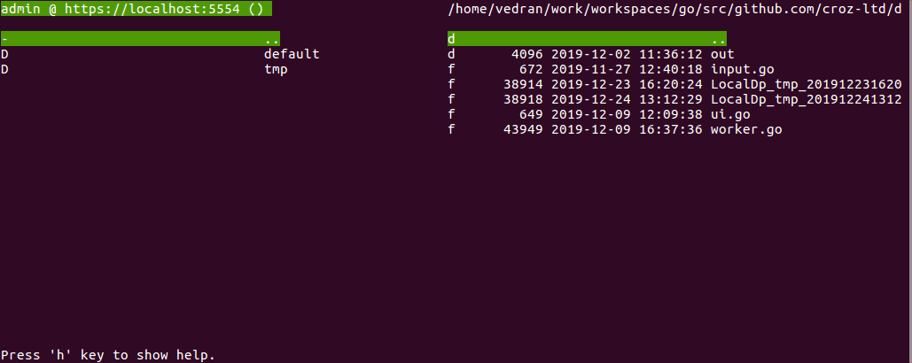

# DataPower Commander

DataPower Commander (dpcmder) is a command-line tool I created for easier maintenance
of files on DataPower appliances and easier development of DataPower appliance solutions.

Current functions:
- basic file maintenance
  - view, edit, copy and delete file hierarchies (DataPower and local file system)
- object maintenance mode (as JSON or XML configurations)
  - view and edit DataPower object
  - copy an object to a JSON/XML file on the local file system
  - create an object from a JSON/XML file on the local file system
  - clone an object
  - view object status
  - view object details (service, policy, match or rule)
- common functions for file and object maintenance mode
  - dpcmder view history (back / forward / jump)
  - filter and search items in the current view
- DataPower domains
  - view DataPower domains and their status
  - create a DataPower Domain
  - export a DataPower domain or the whole appliance ("copy" to the local filesystem)
- sync mode
  - turn on to automatically upload new and changed files from a local filesystem to a DataPower
  - useful for development to automatically propagate your changes from any IDE/editor you are using to DataPower



You can check some [dpcmder screenshots](./docs/screenshots.md) to better see
typical uses of dpcmder in daily work.


## Download

If you don't want to build applications yourself (or run it using "go run"),
32 bit and 64 bit binaries are available for 3 platforms (Linux, Mac, Windows)
under [releases](./releases).

## Install

From project directory:
```bash
go install
```

## Run

```bash
dpcmder -l LOCAL_FOLDER_PATH [-r DATA_POWER_REST_URL | -s DATA_POWER_SOMA_AMP_URL] [-u USERNAME] [-p PASSWORD] [-d DP_DOMAIN] [-x PROXY_SERVER] [-c DP_CONFIG_NAME] [-debug]
```

## Saving DataPower connection parameters

If you choose to use flag "-c" to save DataPower connection parameters be aware
that password is saved if provided with "-p" flag. **Though password is not saved
as clear text it is not encrypted so don't save password if you are afraid
your dpcmder configuration file (~/.dpcmder/config.json) could be compromised.**

## Build

Build should be done from project directory.

Local build:
```sh
go build dpcmder.go
```

Local cross-platform build:
```sh
GOOS=windows GOARCH=amd64 go build -o dpcmder-win-amd64.exe dpcmder.go
GOOS=darwin GOARCH=amd64 go build -o dpcmder-mac-amd64 dpcmder.go
GOOS=linux GOARCH=amd64 go build -o dpcmder-linux-amd64 dpcmder.go
```

Local cross-platform build with version flags and stripping of debug information
(should be done after properly tagging version with `git tag`):
```sh
GOOS=windows GOARCH=amd64 go build -ldflags="-s -w -X 'github.com/croz-ltd/dpcmder/help.Version=$(git tag | tail -n1)' -X 'github.com/croz-ltd/dpcmder/help.Platform=windows/amd64' -X 'github.com/croz-ltd/dpcmder/help.BuildTime=$(git tag | tail -n1).$(date -u -Iseconds)'" -o release/dpcmder-win-amd64.exe dpcmder.go
GOOS=darwin GOARCH=amd64 go build -ldflags="-s -w -X 'github.com/croz-ltd/dpcmder/help.Version=$(git tag | tail -n1)' -X 'github.com/croz-ltd/dpcmder/help.Platform=darwin/amd64' -X 'github.com/croz-ltd/dpcmder/help.BuildTime=$(git tag | tail -n1).$(date -u -Iseconds)'" -o release/dpcmder-mac-amd64 dpcmder.go
GOOS=linux GOARCH=amd64 go build -ldflags="-s -w -X 'github.com/croz-ltd/dpcmder/help.Version=$(git tag | tail -n1)' -X 'github.com/croz-ltd/dpcmder/help.Platform=linux/amd64' -X 'github.com/croz-ltd/dpcmder/help.BuildTime=$(git tag | tail -n1).$(date -u -Iseconds)'" -o release/dpcmder-linux-amd64 dpcmder.go
```

After building binary it can be compressed using excellent
[UPX](https://upx.github.io/) command:
```sh
upx --lzma release/*
```

## Diff command ('d' key)

Diff command in dpcmder is in the latest version by default mapped to diff command.
Before it was mapped to ldiff command which is not an existing Linux command but
one simple script which should be created by dpcmder user which combines "diff"
and "less" commands because dpcmder relies on all external commands to
"take over" control from dpcmder and not give control back until the user quits
those external commands.
If "diff" command is used it is executed twice and is not using all diff flags
which ensures the best possible output (such as "-r" - recursive) - for that
reason warning is produced in the dpcmder status bar.

For best results create executable ldiff script in $PATH (for example
/usr/local/bin/ldiff) with something like:

``` bash
#!/bin/bash
diff -u -r --color=always "$1" "$2" | less -R
```

Or if "--color" flag is not available:

``` bash
#!/bin/bash
diff -u -r "$1" "$2" | cdiff | less -R
```

## Helpful notes for Windows users

DataPower Commander uses [tcell](https://github.com/gdamore/tcell) Go package
for cross-platform interactions with text terminals. This package provides great
cross-platform terminal support however there are few limitations:

> Windows console mode applications are supported.
> Unfortunately mintty and other cygwin style applications are not supported.

> Modern console applications like ConEmu, as well as the Windows 10 console
> itself, support all the good features (resize, mouse tracking, etc.)

DataPower commander is tested under [cmder](https://cmder.net/) environment
which uses [ConEmu](https://conemu.github.io/). In this environment default
dpcmder view & edit commands (less & vi) are available so you should be able
to quickly start using dpcmder there.

DataPower Commander needs to have a proper view, edit and diff command
configured if you want to use its full potential. Unfortunately, all Windows OS
versions don't come with default editor so I didn't try to match default
values for Windows OS but I would suggest you to install Windows version of vi
and less (which are default ones for View and Edit commands) if you are running
dpcmder under Windows cmd. An alternative is to map both of those to some existing
"blocking" editor (such as notepad) in ~/.dpcmder/config.json. For more
details please check help.

## A bit of history of dpcmder

When I started to work with DataPower (beginning of 2008) I plunged into the world
of XSLT-s - it is a verbose functional programming world. As Java developer, I
used Eclipse IDE a lot and I found it a good tool to work with XML/XSL files.
There were some parts of XSLT I could even test without uploading them to DataPower,
using functionalities available in Eclipse but for some DataPower-specific parts
the only way to test it was to upload them to the DataPower appliance.

Soon I realized it is a bit cumbersome to upload files to DataPower appliance
during development. I found IBM created an eclipse plugin that enabled us to
quickly copy files from local eclipse workspace to DataPower appliance
(and vice versa) which made the development cycle much more comfortable and faster.
Unfortunately, IBM shipped this plugin only until DataPower firmware 3.8.2 and
stopped maintaining this plugin to be compatible with new DataPower versions.
There were some workaround solutions but none felt right for me.

At some point, I thought about developing Eclipse plugin myself but decided to go
other direction because of the following reasons:
- from all sources I checked Eclipse plugin development is not a fulfilling experience
- I thought it would be nice to have a tool which could be used to maintain files on DataPower by sysadmins, not only developers

At first, I created a bash shell which had basic functionalities I planned to
implement but on my Linux box, it was working a bit slow. Then I started this
script in Linux bash console using cmder Console Emulator (https://cmder.net/)
and realized it is so slow it is almost unusable. I wanted to have:
- the application which would work on at least 3 major OS-es (both my company and our clients use all 3 of them)
- the command-line application so it can be used through ssh on some jump server if required
- the application which would work fast
- the application which would be simple to use (and similar to Midnight Commander and/or Total Commander)

I evaluated a few technologies to implement this. I checked Node.js pkg and
Golang, which both enabled me to build executables for all target platforms on
my Linux machine. In the end I decided to go with the Go as it produced smaller
executables and felt more appropriate for TUI development.

One issue which is still left partially unsolved is handling keypresses for some
of the special keys on Windows (maybe MacOS) environment. Seems like it is not
quite easy to create a portable application which can correctly use arrow keys,
Home & End key etc so I added alternative keys for each of those actions. Best
of all, if you are not sure just press 'h' key (or any other unmapped key) and
help will be shown.


## dpcmder funcions help

```
ArrowUp / i          - move one item up
ArrowDown / k        - move one item down
Shift+ArrowUp / I    - select a current item and move one item up (can use Alt instead of Shift)
Shift+ArrowDown / K  - select a current item and move one item down (can use Alt instead of Shift)
PgUp / u             - move a page of items up
PgDown / o           - move a page of items down
Shift+PgUp / U       - select a current item and move a page of items up
Shift+PgDown / O     - select a current item and move a page of items down
Home / a             - move to the first item
End / z              - move to the last item
Shift+Home / A       - move to the first item and select all items from the current one to the first one
Shift+End / Z        - move to the last item and select all items from the current one to the last one
ArrowLeft / j        - scroll items left (useful for long names)
ArrowRight / l       - scroll items right (useful for long names)
Shift+ArrowLeft / J  - navigate to the previous view for the current side
Shift+ArrowRight / L - navigate to the next view for the current side
H                    - show view history list - can jump to any view in the current history
Space                - select current item
TAB                  - switch from left to right panel and vice versa
Return               - enter directory
F2/2                 - refresh focused pane (reload files/dirs)
F3/3                 - view current file or DataPower configuration
                       (see "Custom external commands" below)
F4/4                 - edit file
                       (see "Custom external commands" below)
F5/5                 - copy the selected (or current if none selected) directories and files
                     - if DataPower domain is selected create an export of the domain
                     - if DataPower configuration is selected create an export of
                       the whole appliance (SOMA only)
                     - in DataPower object configuration mode copy DataPower
                       object to file or copy file with proper object configuration
                       to DataPower object (XML/JSON, depending on REST/SOMA
                       management interface used)
F7/7                 - create directory
                     - create a new DataPower domain
F8/8                 - create an empty file
                     - create a new DataPower configuration
F9/9                 - clone a current DataPower configuration under a new name
                     - clone a current DataPower object under new name
DEL/x                - delete selected (or current if none selected) directories and files
                     - delete a DataPower configuration
                     - delete a DataPower object
d                    - diff current files/directories
                       (should be "blocking" - see "Custom external commands" below)
                     - diff changes on modified DataPower object (SOMA only)
/                    - find string
n                    - find next string
m                    - show all status messages saved in the history
p                    - find previous string
f                    - filter visible items by a given string
.                    - enter a location (full path) for the local file system
s                    - auto-synchronize selected directories (local to DataPower)
S                    - save running DataPower configuration (SOMA only)
0                    - toggle DataPower view from filestore view to object view
                     - when using SOMA access changed objects are marked and object
                       changes can be shown using diff (d key)
?                    - show status information for the current DataPower object
P                    - show DataPower policy for the current DataPower object
                       (can be used only on service, policy, matches,rules & actions)
                       exports the current DataPower object, analyzes it and
                       shows service, policy, matches, rules and actions for
                       the object
h                    - show help
q                    - quit
any-other-char       - show help (+ hex value of the key pressed visible in the status bar)

Navigational keys (except Left/Right can be used in combination with Shift for selections):
PgUp  Up  PgDn
Left Down Right
Home      End

Alternative keys:
u i o
j k l
a   z

Custom external commands (Viewer/Editor/Diff):
dpcmder configuration is saved to ~/.dpcmder/config.json where commands used for
calling external commands are set. By default, these are "less", "vi" and "diff"
but could be any commands. All of those commands should be started in the
foreground and should wait for the user's input to complete. For example for
viewers "less" or "more" can be used while "cat" will not work. For file
comparison, normal "diff" command can be used as a workaround but "blocking" diff
command should be used (like vimdiff). Custom ldiff script which combines diff
and "less" commands can be easily prepared using something like:
  'diff "$1" "$2" | less'
or for the fancier colored output you can use something like:
  'diff -u -r --color=always "$1" "$2" | less -r'.

SOMA (+ AMP) vs REST:
SOMA and AMP interfaces have one shortcoming - you can't see domain list if you
don't have proper rights. With REST you can get domain list without any credentials.
Some new features added are SOMA-only. For example, with REST you can't compare
persisted DataPower object configuration to saved configuration.
```
