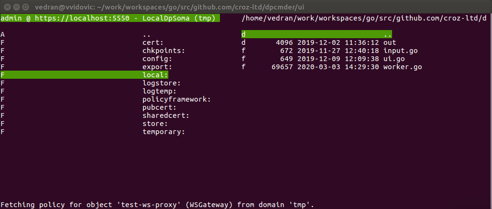

# Examples of DataPower Commander screenshots

Few example screenshots from dpcmder in use.

## Browse saved DataPower appliances

## Browse DataPower filestores, directories & files

## Browse DataPower object classes & objects

## Edit DataPower object

## View DataPower object unsaved changes

## View DataPower object details (service, policy, match & rule)

## Create DataPower appliance or domain export

